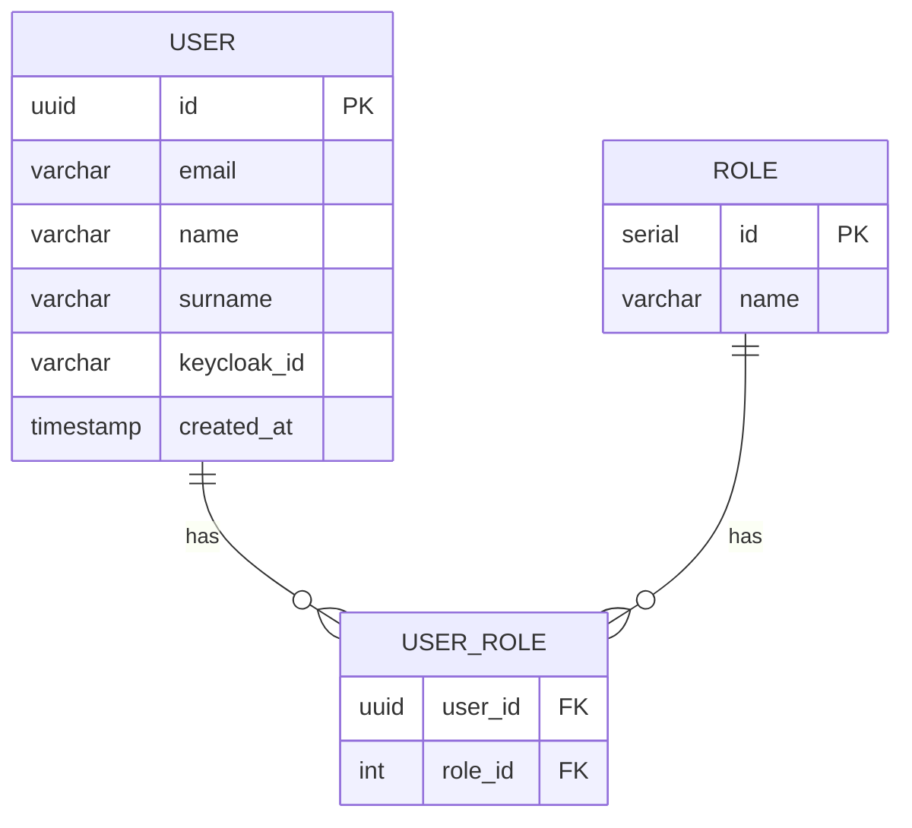
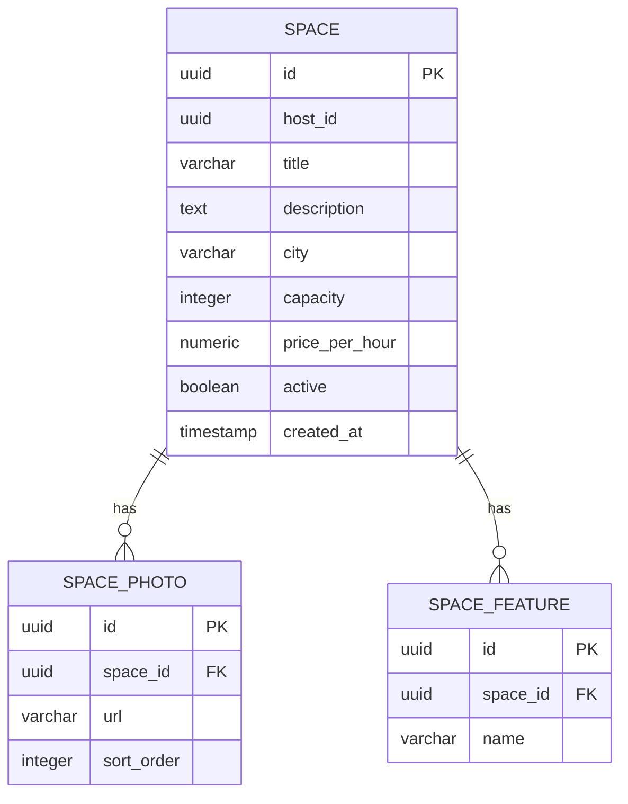
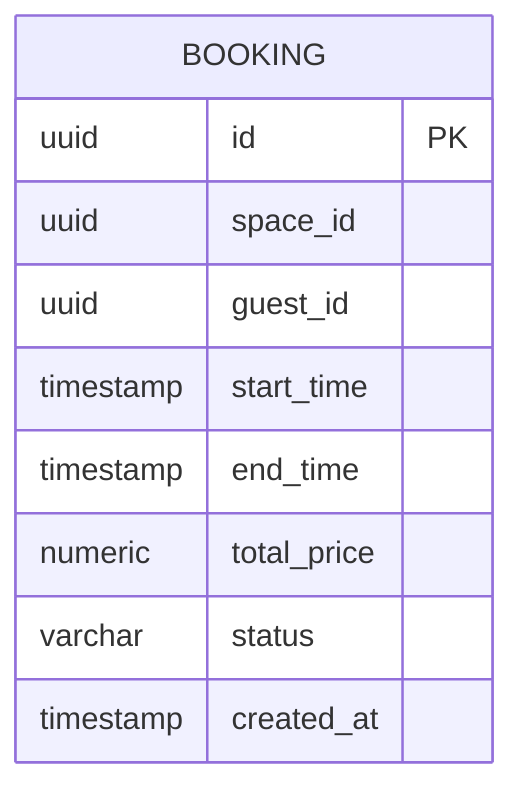

# **DATABASE_SCHEMAS.md**

Esquemas de base de datos – BalconazoApp

---

## **Índice**

1. [Introducción](#1-introducción)

2. [Convenciones](#2-convenciones)

3. [Base de datos de usuarios (`users-service`)](#3-base-de-datos-de-usuarios-users-service)

4. [Base de datos de espacios (`spaces-service`)](#4-base-de-datos-de-espacios-spaces-service)

5. [Base de datos de reservas (`bookings-service`)](#5-base-de-datos-de-reservas-bookings-service)

6. [Consultas SQL frecuentes](#6-consultas-sql-frecuentes)

7. [Troubleshooting de base de datos](#7-troubleshooting-de-base-de-datos)

---

## **1. Introducción**

BalconazoApp sigue el patrón **database-per-service**:

* Cada microservicio tiene su propia base de datos PostgreSQL.

* No hay claves foráneas físicas entre servicios (solo **referencias lógicas**).

---

## **2. Convenciones**

* Tipo de ID: `UUID` (PRIMARY KEY).

* Nombres de tabla: `snake_case` en minúsculas.

* Timestamps: `TIMESTAMP` (se recomienda almacenarlos en UTC).

---

## **3. Base de datos de usuarios (`users-service`)**

### **3.1 Diagrama ER**



### **3.2 Script de creación**

```sql
CREATE TABLE IF NOT EXISTS users (

    id UUID PRIMARY KEY,

    email VARCHAR(255) NOT NULL UNIQUE,

    name VARCHAR(100) NOT NULL,

    surname VARCHAR(150) NOT NULL,

    keycloak_id VARCHAR(255) NOT NULL UNIQUE,

    created_at TIMESTAMP NOT NULL DEFAULT NOW()

);

CREATE TABLE IF NOT EXISTS roles (

    id SERIAL PRIMARY KEY,

    name VARCHAR(50) NOT NULL UNIQUE

);

CREATE TABLE IF NOT EXISTS user_roles (

    user_id UUID NOT NULL REFERENCES users(id) ON DELETE CASCADE,

    role_id INTEGER NOT NULL REFERENCES roles(id) ON DELETE CASCADE,

    PRIMARY KEY (user_id, role_id)

);

CREATE INDEX IF NOT EXISTS idx_users_email ON users(email);
```

---

## **4. Base de datos de espacios (`spaces-service`)**

### **4.1 Diagrama ER**



### **4.2 Script de creación**

```sql
CREATE TABLE IF NOT EXISTS spaces (

    id UUID PRIMARY KEY,

    host_id UUID NOT NULL,

    title VARCHAR(150) NOT NULL,

    description TEXT NOT NULL,

    city VARCHAR(100) NOT NULL,

    capacity INTEGER NOT NULL,

    price_per_hour NUMERIC(10,2) NOT NULL,

    active BOOLEAN NOT NULL DEFAULT TRUE,

    created_at TIMESTAMP NOT NULL DEFAULT NOW()

    -- host_id referencia lógica a users.id en users-service

);

CREATE TABLE IF NOT EXISTS space_photos (

    id UUID PRIMARY KEY,

    space_id UUID NOT NULL REFERENCES spaces(id) ON DELETE CASCADE,

    url VARCHAR(500) NOT NULL,

    sort_order INTEGER NOT NULL DEFAULT 0

);

CREATE TABLE IF NOT EXISTS space_features (

    id UUID PRIMARY KEY,

    space_id UUID NOT NULL REFERENCES spaces(id) ON DELETE CASCADE,

    name VARCHAR(100) NOT NULL

);

CREATE INDEX IF NOT EXISTS idx_spaces_city ON spaces(city);

CREATE INDEX IF NOT EXISTS idx_spaces_price ON spaces(price_per_hour);

CREATE INDEX IF NOT EXISTS idx_spaces_active ON spaces(active);
```

---

## **5. Base de datos de reservas (`bookings-service`)**

### **5.1 Diagrama ER**



### **5.2 Script de creación**

```sql
CREATE TABLE IF NOT EXISTS bookings (

    id UUID PRIMARY KEY,

    space_id UUID NOT NULL,

    guest_id UUID NOT NULL,

    start_time TIMESTAMP NOT NULL,

    end_time TIMESTAMP NOT NULL,

    total_price NUMERIC(10,2) NOT NULL,

    status VARCHAR(20) NOT NULL,

    created_at TIMESTAMP NOT NULL DEFAULT NOW()

    -- space_id referencia lógica a spaces.id

    -- guest_id referencia lógica a users.id

);

ALTER TABLE bookings

    ADD CONSTRAINT chk_booking_time_range CHECK (start_time < end_time);

CREATE INDEX IF NOT EXISTS idx_bookings_space_time

    ON bookings(space_id, start_time, end_time);

CREATE INDEX IF NOT EXISTS idx_bookings_guest

    ON bookings(guest_id);
```

---

## **6. Consultas SQL frecuentes**

### **6.1 Comprobar solapes de reserva**

```sql
SELECT *

FROM bookings b

WHERE b.space_id = :spaceId

  AND b.status IN ('PENDING', 'CONFIRMED')

  AND (b.start_time < :endTime AND b.end_time > :startTime);
```

### **6.2 Buscar espacios con filtros**

```sql
SELECT *

FROM spaces s

WHERE s.active = TRUE

  AND (:city IS NULL OR s.city = :city)

  AND (:minPrice IS NULL OR s.price_per_hour >= :minPrice)

  AND (:maxPrice IS NULL OR s.price_per_hour <= :maxPrice)

  AND (:capacity IS NULL OR s.capacity >= :capacity)

ORDER BY s.price_per_hour ASC

LIMIT :size OFFSET :offset;
```

---

## **7. Troubleshooting de base de datos**

### **Problema 1: conflicto entre esquema real y migraciones Flyway**

* **Síntoma**: Flyway lanza `Validate failed` al arrancar.

* **Causa**: cambios manuales en tablas o migraciones alteradas.

* **Solución**:

  * En desarrollo: borrar el volumen de la BD y dejar que Flyway regenere el esquema.

  * En producción: crear nuevas migraciones que ajusten el esquema actual (nunca tocar migraciones ya ejecutadas).

---

### **Problema 2: lentitud en consultas de reservas**

* **Síntoma**: consultas a reservas tardan mucho con muchas filas.

* **Causa**: falta de índices en campos usados en filtros (`space_id`, `start_time`, `end_time`).

* **Solución**:

  * Verificar la existencia de `idx_bookings_space_time`.

  * Añadir índices adicionales según patrones de uso.

---

### **Problema 3: errores de integridad en espacios/usuarios**

* **Síntoma**: referencias a `host_id` o `space_id` inexistentes.

* **Causa**: al no tener FK físicas entre servicios, se han borrado registros en un servicio sin limpiar referencias en otro.

* **Solución**:

  * Implementar lógica de “soft delete” y validaciones antes de eliminar registros.

  * Añadir validaciones de existencia de `spaceId`/`hostId` al crear o modificar entidades.
